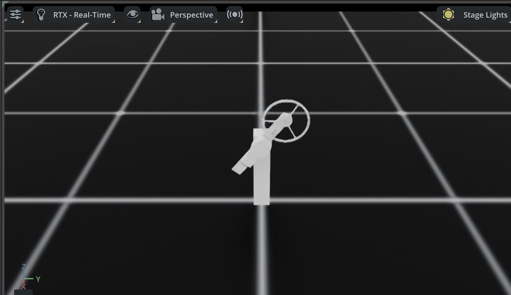

# InertialWheel Pendulum — Isaac Lab Project

An underactuated inertial wheel pendulum RL environment built on [Isaac Lab](https://github.com/isaac-sim/IsaacLab). The system consists of a passive pendulum (body_link) with a reaction wheel (wheel_link) at the tip — only the wheel is actuated, making this a classic **underactuated swing-up control** problem.

## Dependencies

- **[Isaac Lab](https://github.com/isaac-sim/IsaacLab)** — robot simulation framework (includes RSL-RL via `isaaclab_rl`)
- Python 3.10+

## Installation

```bash
# Install this package (Isaac Lab must already be installed separately)
python -m pip install -e source

# Verify the environment is registered
python -c "import gymnasium as gym; gym.make('Isaac-Inertialwheel-v0')"
```

## Task: `Isaac-Inertialwheel-v0`

### System Overview

```
base_link (fixed)
  └── body_link (passive hinge joint, Z-axis)
        └── wheel_link (actuated hinge joint, Z-axis)
```

- **Action** (1-D): torque on the reaction wheel `[-50, 50]` N·m
- **Observation** (5-D): `[sin(body_q), cos(body_q), wheel_q, body_vel, wheel_vel]`
  - `sin/cos` encoding avoids the π-wrap discontinuity for the pendulum angle
- **Reward**: smooth cos-based reward — `(cos(θ − target) + 1) / 2` + velocity penalties
- **Termination**: time-out only (no fall termination — the pendulum needs the full 360° range to swing up)
- **Episode length**: 5 seconds at 60 Hz policy rate → 300 steps

The target angle is configurable in `inertialwheel_env_cfg.py`:

```python
# source/InertialWheel/tasks/manager_based/inertialwheel/inertialwheel_env_cfg.py

upright = RewTerm(
    func=mdp.upright_reward_cos,
    weight=10.0,
    params={
        "asset_cfg": SceneEntityCfg("robot", joint_names=["body_joint"]),
        "target": math.pi,          # Upright (default)
        # "target": math.pi * 4/5,  # Example: 144° from downward
        # "target": math.pi / 2,    # Example: horizontal
    },
)
```

## Training

```bash
# With rendering (default: 4096 parallel envs)
python scripts/rsl_rl/train.py --task Isaac-Inertialwheel-v0 --max_iterations 1500

# Headless (faster)
python scripts/rsl_rl/train.py --task Isaac-Inertialwheel-v0 --headless --max_iterations 1500

# Custom number of environments
python scripts/rsl_rl/train.py --task Isaac-Inertialwheel-v0 --headless --num_envs 2048 --max_iterations 1500
```

Training logs are saved to `logs/rsl_rl/inertialwheel/`. Monitor with TensorBoard:

```bash
tensorboard --logdir logs/rsl_rl/inertialwheel
```

### PPO Configuration (default)

| Parameter | Value | Note |
|-----------|-------|------|
| `num_steps_per_env` | 128 | ~2.1 s of real-time per rollout |
| `actor_hidden_dims` | [64, 64] | |
| `actor_obs_normalization` | True | Running mean/std for observations |
| `gamma` | 0.99 | Discount factor |
| `entropy_coef` | 0.02 | Exploration bonus |
| `clip_actions` | 1.0 | Output clipped to [-1, 1] before scaling |

## Testing the Trained Policy

```bash
python scripts/rsl_rl/play.py --task Isaac-Inertialwheel-v0
```

## Test Results



## TODO

- [ ] Train a converged policy (mean reward rising)
- [ ] Sim2Sim: deploy the trained policy to MuJoCo for validation

## Project Structure

```
InertialWheel/
├── source/InertialWheel/          # Python package
│   └── InertialWheel/
│       ├── assets/
│       │   └── InertialWheel.py   # Robot articulation config (actuators, physics)
│       └── tasks/
│           └── manager_based/inertialwheel/
│               ├── __init__.py     # Gym registration
│               ├── inertialwheel_env_cfg.py  # MDP config (obs, actions, rewards)
│               └── agents/
│                   └── rsl_rl_ppo_cfg.py     # PPO hyper-parameters
├── scripts/rsl_rl/                # Training & play scripts
├── usd/                           # USD robot model
├── Mujoco/                        # MuJoCo reference model
└── logs/rsl_rl/inertialwheel/     # Training logs
```
